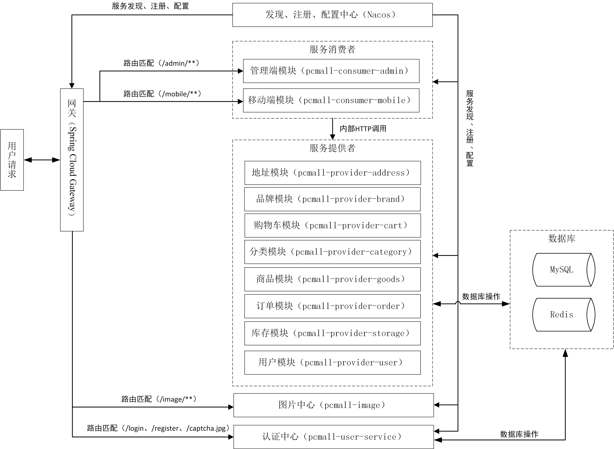

# 电脑配件商城（PCMall）

## 项目说明

这是一个Java项目，采用前后端分离，实现电脑配件商城的基本功能，比如：

* 用户登录注册
* 商品的查询和浏览
* 商品品牌管理
* 商品分类管理
* 购物车管理
* 地址管理
* 订单管理
* 评价以及评论功能（当前任务）
* 用户基本信息管理
* AI 助手根据用户需求帮助用户挑选商品
* ...

Android App项目说明：[PCMall-Mobile](https://github.com/MnTeriri/PCMall-Mobile) 
Vue项目说明：[PCMall-Vue](https://github.com/MnTeriri/PCMall-Vue)

## 使用的框架

* Spring Boot
* Spring Cloud
* LangChain4j（LLM 集成 / RAG 检索增强）
* Milvus（向量数据库）
* Ollama（本地 Embedding 与推理）
* DeepSeek API（远程对话模型）
* Nacos
* Seata
* Sentinel
* RocketMQ
* Spring Cloud GateWay
* Loadbalancer
* OpenFeign
* Spring Security
* Spring AOP
* Spring Cache
* Spring Quartz
* Spring Redis
* MyBatis
* MyBatis-Plus
* Knife4j
* Docker
* ...

## 版本说明

### v1.0：

1. 使用Nacos作为服务发现、注册、配置中心
2. 使用Spring Cloud GateWay作为API网关
3. 使用Spring Security、JWT实现鉴权
4. 使用Loadbalancer、OpenFeign完成微服务远程调用
5. 使用MyBatis和MyBatis-Plus实现持久层
6. 使用Redis实现MyBatis二级缓存
7. 使用Quartz完成定时任务处理
8. 使用存储过程，配合锁表和事务，完成订单的创建和取消，并使用MyBatis调用存储过程

### v2.0：

#### 相比v1.0增添如下功能：

1. 引入分布式事务Seata，处理全局事务
2. 引入RocketMQ，处理定时任务
3. 对服务提供者采取更细致的分割，为后续能实现分库分表做准备
4. 使用Spring AOP，灵活的对方法的功能进行拓展
5. 使用Spring Cache，对品牌、分类等服务提供者的缓存进行细致化管理
6. 使用CompletableFuture和ThreadPoolTaskExecutor完成异步远程调用
7. 使用Knife4j，完成API文档编写
8. 使用Docker部署相关依赖环境以及项目代码
9. 新增 pcmall-ai 模块，集成 LangChain4j + DeepSeek/Ollama，实现 AI 购物助手
10. 搭建 Milvus 向量数据库，构建静态知识库（帮助文档 RAG）与动态知识库（百万级商品语义检索）
11. 实现商品信息变更的 RocketMQ 通知机制，驱动向量库增量更新
12. 实现全量商品向量化初始化管线，支持分页拉取、批量 Embedding、Redis 进度持久化与断点续传
13. 实现对话记忆的持久化存储（Redis、MySQL），保证会话记忆的可靠查询与恢复

## 架构图

### v1.0：

### v2.0：

## 界面效果

### 移动端

<table>
    <tr>
        <td></td>
        <td></td>
        <td></td>
        <td></td>
    </tr>
    <tr>
        <td></td>
        <td></td>
        <td></td>
        <td></td>
    </tr>
    <tr>
        <td></td>
        <td></td>
        <td></td>
        <td></td>
    </tr>
    <tr>
        <td></td>
    </tr>
</table>

### 管理端

## 项目结构

### v1.0：

~~~
PCMall
├── pcmall-common         // 通用模块
├── pcmall-gateway        // 网关模块 [10000]
├── pcmall-user-service   // 认证中心 [10001]
├── pcmall-image          // 图片中心 [10002]
├── pcmall-consumer       // 服务消费者模块
│      └── pcmall-consumer-admin                 // 管理端模块 [12000]
│      └── pcmall-consumer-mobile                // 移动端模块 [12001]
├── pcmall-provider       // 服务提供者模块
│      └── pcmall-provider-goods                 // 商品中心 [11000]
│      └── pcmall-provider-payment               // 订单中心 [11001]
│      └── pcmall-provider-user                  // 用户中心 [11002]
├──pom.xml                // 公共依赖
~~~

### v2.0：

~~~
PCMall
├── pcmall-common         // 通用模块
├── pcmall-gateway        // 网关模块 [10000]
├── pcmall-user-service   // 认证中心 [10001]
├── pcmall-image          // 图片中心 [10002]
├── pcmall-ai             // AI 模块 [10003]
├── pcmall-consumer       // 服务消费者模块
│      └── pcmall-consumer-admin                 // 管理端模块 [12000]
│      └── pcmall-consumer-mobile                // 移动端模块 [12001]
├── pcmall-provider       // 服务提供者模块
│      └── pcmall-provider-address               // 地址模块 [11000]
│      └── pcmall-provider-brand                 // 商品品牌模块 [11001]
│      └── pcmall-provider-cart                  // 购物车模块 [11002]
│      └── pcmall-provider-category              // 商品分类模块 [11003]
│      └── pcmall-provider-goods                 // 商品模块 [11004]
│      └── pcmall-provider-order                 // 订单模块 [11005]
│      └── pcmall-provider-storage               // 商品库存模块 [11006]
│      └── pcmall-provider-user                  // 用户模块 [11007]
├──pom.xml                // 公共依赖
~~~

## 依赖框架部署

### 1. Nacos部署
1. Docker部署  
   在docker-compose.yml下编写如下代码：
   ~~~yaml
   services:
     pcmall-nacos:
       image: nacos/nacos-server:v2.5.0
       container_name: pcmall-nacos
       build:
         context: ./nacos
       environment:
         - MODE=standalone
       ports:
         - "8848:8848"
         - "9848:9848"
         - "9849:9849"
       volumes:
         - pcmall-nacos-data:/home/nacos
   volumes:
     pcmall-nacos-data:
   ~~~
   volumes用于将容器目录映射到宿主机（对于Windows映射在WSL2的"/docker-desktop/mnt/docker-desktop-disk/data/docker/volumes"目录）；
   环境参数参考[nacos-docker](https://github.com/nacos-group/nacos-docker/blob/master/README_ZH.md)的属性配置列表。

2. Windows部署  
参照[Nacos官网](https://nacos.io/docs/latest/quickstart/quick-start/?spm=5238cd80.1f77ca18.0.0.4d31e37e7pK7xN)的说明进行操作。
如果执行单机部署，请修改/bin/startup.bin，将set MODE设置为"standalone"。

### 2. Sentinel部署
1. Docker部署  
   * 编写如下Dockerfile：
   ~~~dockerfile
   FROM amd64/buildpack-deps:buster-curl as installer
   
   ARG SENTINEL_VERSION=1.8.8
   
   RUN set -x \
       && curl -SL --output /home/sentinel-dashboard.jar https://github.com/alibaba/Sentinel/releases/download/${SENTINEL_VERSION}/sentinel-dashboard-${SENTINEL_VERSION}.jar
   
   FROM openjdk:8-jre-slim
   
   # copy sentinel jar
   COPY --from=installer ["/home/sentinel-dashboard.jar", "/home/sentinel-dashboard.jar"]
   
   ENV JAVA_OPTS '-Dserver.port=8088 -Dcsp.sentinel.dashboard.server=localhost:8088'
   
   RUN chmod -R +x /home/sentinel-dashboard.jar
   
   EXPOSE 8088
   
   CMD java ${JAVA_OPTS} -jar /home/sentinel-dashboard.jar
   ~~~
   
   * 在docker-compose.yml下编写如下代码：
   ~~~yml
   services:
     pcmall-sentinel:
       container_name: pcmall-sentinel
       build:
         context: ./sentinel
       ports:
         - "8088:8088"
   ~~~
   context对应Dockerfile所在路径。
2. Windows部署  
参照[Sentinel官网](https://sentinelguard.io/zh-cn/docs/dashboard.html)即可。

### 3. Seata部署
1. Docker部署  
   * 先在[Seata官网](https://seata.apache.org/zh-cn/unversioned/download/seata-server/)下载Seata安装包，然后解压。
   * 打开conf/application.yml文件，修改server-addr为nacos的IP（Docker下部署Nacos则设置为"容器名称:端口"），
     修改后将application.yml复制到Dockerfile文件的目录中。 application.yml修改后代码如下：
   ~~~yaml
   server:
     port: 7091
   
   spring:
     application:
       name: seata-server
   
   logging:
     config: classpath:logback-spring.xml
     file:
       path: ${log.home:${user.home}/logs/seata}
     extend:
       logstash-appender:
         destination: 127.0.0.1:4560
       kafka-appender:
         bootstrap-servers: 127.0.0.1:9092
         topic: logback_to_logstash
   
   console:
     user:
       username: seata
       password: seata
   
   seata:
     config:
       # support: nacos 、 consul 、 apollo 、 zk  、 etcd3
       type: nacos
       nacos:
         server-addr: pcmall-nacos:8848
         namespace: seata
         group: SEATA_GROUP
         data-id: seataServer.properties
       
     registry:
       # support: nacos 、 eureka 、 redis 、 zk  、 consul 、 etcd3 、 sofa
       type: nacos
       preferred-networks: 30.240.*
       nacos:
         application: seata-server
         server-addr: pcmall-nacos:8848
         namespace: seata
         group: SEATA_GROUP
         cluster: default
   
     store:
       # support: file 、 db 、 redis 、 raft
       mode: db
     #  server:
     #    service-port: 8091 #If not configured, the default is '${server.port} + 1000'
     security:
       secretKey: SeataSecretKey0c382ef121d778043159209298fd40bf3850a017
       tokenValidityInMilliseconds: 1800000
       ignore:
         urls: /,/**/*.css,/**/*.js,/**/*.html,/**/*.map,/**/*.svg,/**/*.png,/**/*.jpeg,/**/*.ico,/api/v1/auth/login,/metadata/v1/**

   ~~~

   * 准备好mysql驱动程序，复制到Dockerfile文件的目录中。

   * 编写如下Dockerfile，将application.yml和jdbc驱动复制到容器对应文件夹。代码如下：
   ~~~dockerfile
   FROM apache/seata-server:2.2.0
   
   COPY ./config/application.yml /seata-server/resources
   COPY ./lib/jdbc /seata-server/libs
   ~~~

   * 在Nacos当中创建命名空间（seata），然后在此命名空间创建seataServer.properties配置，
     group设置为SEATA_GROUP（需要和上述配置的namespace、group属性相对应）。
     设置好后将script/config-center/config.txt当中的内容复制，并修改此部分为下述代码（配置模式为db，并填写自己数据库配置）。
     如果数据库在宿主机当中，使用"host.docker.internal"域名访问宿主机的数据库
   ~~~properties
   #Transaction storage configuration, only for the server. The file, db, and redis configuration values are optional.
   store.mode=db
   store.lock.mode=db
   store.session.mode=db
   #Used for password encryption
   store.publicKey=
            
   #These configurations are required if the `store mode` is `db`. If `store.mode,store.lock.mode,store.session.mode` are not equal to `db`, you can remove the configuration block.
   store.db.datasource=druid
   store.db.dbType=mysql
   store.db.driverClassName=com.mysql.cj.jdbc.Driver
   store.db.url=jdbc:mysql://host.docker.internal:3306/seata?useUnicode=true&characterEncoding=utf-8&useSSL=false&serverTimezone=GMT%2B8
   store.db.user=root
   store.db.password=root
   store.db.minConn=5
   store.db.maxConn=30
   store.db.globalTable=global_table
   store.db.branchTable=branch_table
   store.db.distributedLockTable=distributed_lock
   store.db.queryLimit=100
   store.db.lockTable=lock_table
   store.db.maxWait=5000
   ~~~
   然后打开script/server/db/mysql.sql，创建名称为seata的数据库。

   * 在docker-compose.yml下编写如下代码：
   ~~~yaml
   services:
     pcmall-seata:
       container_name: pcmall-seata
       build:
         context: ./seata
       ports:
         - "7091:7091"
         - "8091:8091"
       environment:
         - STORE_MODE=db
         - SEATA_IP=宿主机IP #不能是127.0.0.1 可以是宿主机地址
         - SEATA_PORT=8091
       depends_on:
         - pcmall-nacos
       volumes:
         - pcmall-seata-data:/seata-server
         - "/usr/share/zoneinfo/Asia/Shanghai:/etc/localtime"  #设置系统时区
         - "/usr/share/zoneinfo/Asia/Shanghai:/etc/timezone"   #设置时区
       extra_hosts:
         - "host.docker.internal:host-gateway"
   volumes:
     pcmall-seata-data:
   ~~~

2. Windows部署  
   /conf/application.yml完全参照上述设置（修改Nacos IP即可）；
   在Nacos当中配置的数据库配置完全参照上述设置（修改数据库地址即可）；
   jdbc驱动需要复制到/lib/jdbc当中。配置好后点击/bin/seata-server.bat即可启动

### 4. RocketMQ部署
1. Docker部署  
   在docker-compose.yml下编写如下代码：
   ~~~yaml
   services:
     pcmall-rocketmq-nameserver:
       image: apache/rocketmq:5.3.1
       container_name: pcmall-rocketmq-nameserver
       ports:
         - "9876:9876"
       networks:
         - rocketmq
       command: sh mqnamesrv
       volumes:
         - pcmall-rocketmq-data:/home/rocketmq
     pcmall-rocketmq-broker:
       image: apache/rocketmq:5.3.1
       container_name: pcmall-rocketmq-broker
       ports:
         - "10909:10909"
         - "10911:10911"
         - "10912:10912"
       environment:
         - NAMESRV_ADDR=pcmall-rocketmq-nameserver:9876
       depends_on:
         - pcmall-rocketmq-nameserver
       networks:
         - rocketmq
       command: sh mqbroker -c ../conf/broker.conf
       volumes:
         - pcmall-rocketmq-data:/home/rocketmq
     pcmall-rocketmq-proxy:
       image: apache/rocketmq:5.3.1
       container_name: pcmall-rocketmq-proxy
       networks:
         - rocketmq
       depends_on:
         - pcmall-rocketmq-broker
         - pcmall-rocketmq-nameserver
       ports:
         - "8080:8080"
         - "8081:8081"
       restart: on-failure
       environment:
         - NAMESRV_ADDR=pcmall-rocketmq-nameserver:9876
       command: sh mqproxy
       volumes:
         - pcmall-rocketmq-data:/home/rocketmq
   
   networks:
     rocketmq:
       driver: bridge
   
   volumes:
     pcmall-rocketmq-data:
   ~~~
   注意：需要对broker进行配置，配置文件在/conf/broker.conf中。  
   其中：messageDelayLevel用于配置延迟等级对应的时间，brokerIP1用于配置broker的IP（Docker环境下如果不配置则会使用容器内地址，在宿主机环境下的程序无法访问到）。
   配置如下：
   ~~~
   messageDelayLevel=1s 5s 10s 30s 1m 2m 3m 4m 5m 6m 7m 8m 9m 10m 15m 20m 30m 1h 2h （添加了15分钟的选项）
   brokerIP1=宿主机IP
   ~~~
2. Windows部署  
   参照[RocketMQ官网](https://rocketmq.apache.org/zh/docs/quickStart/01quickstart)

## 核心代码

### 1. Spring Cloud GateWay使用

### 2. Seata的使用

1. 配置微服务模块  
pom.xml添加如下依赖
   ~~~
   <!-- Spring Cloud Ailibaba Seata -->
   <dependency>
       <groupId>io.seata</groupId>
       <artifactId>seata-spring-boot-starter</artifactId>
   </dependency>
   <dependency>
       <groupId>com.alibaba.cloud</groupId>
       <artifactId>spring-cloud-starter-alibaba-seata</artifactId>
       <exclusions>
           <exclusion>
               <groupId>io.seata</groupId>
               <artifactId>seata-spring-boot-starter</artifactId>
          </exclusion>
       </exclusions>
   </dependency>
   ~~~
   application.properties添加如下配置
   ~~~
   seata.tx-service-group=my_test_tx_group ---------------> 事务分组配置（在v1.5之后默认值为default_tx_group）
   seata.service.vgroup-mapping.my_test_tx_group=default  ---------------> 指定事务分组至集群映射关系（等号右侧的集群名需要与Seata-server注册到Nacos的cluster保持一致）
   seata.registry.type=nacos      ---------------> 使用nacos作为注册中心
   seata.registry.nacos.server-addr=127.0.0.1:8848
   seata.registry.nacos.namespace=seata              ---------------> Seata命名空间（应与seata-server实际注册的命名空间一致）
   seata.registry.nacos.application=seata-server     ---------------> Seata服务名（应与seata-server实际注册的服务名一致）
   seata.registry.nacos.group=SEATA_GROUP            ---------------> Seata分组名（应与seata-server实际注册的分组名一致）
   seata.data-source-proxy-mode=AT
   ~~~

2. 使用  
在所需的方法上加上注解@GlobalTransactional，代码如下
   ~~~java
   @GlobalTransactional(rollbackFor = Exception.class)
   public void outboundDelivery(Storage storage) {
       //业务逻辑
   }
   ~~~

### 2. RocketMQ的使用

1. broker执行

   ~~~
   sh mqadmin updateTopic -c DefaultCluster -t test-topic
   docker pull apacherocketmq/rocketmq-dashboard:2.1.0
   docker run -d --name rocketmq-dashboard --network docker_rocketmq -e "JAVA_OPTS=-Drocketmq.namesrv.addr=pcmall-rocketmq-nameserver:9876" -p 8082:8082 apacherocketmq/rocketmq-dashboard:2.1.0
   ~~~