# 电脑配件商城（PCMall）

## 项目说明

这是一个Java项目，采用前后端分离，实现电脑配件商城的基本功能，比如：

* 用户登录注册
* 商品的查询和浏览
* 商品品牌管理
* 商品分类管理
* 购物车管理
* 地址管理
* 订单管理（可退货可取消）
* 用户基本信息管理
* ...

Android App项目说明：[PCMall-Mobile](https://github.com/MnTeriri/PCMall-Mobile)

## 使用的框架
* Spring Boot
* Spring Cloud
* Nacos
* Seata
* Sentinel
* Spring Cloud GateWay
* Loadbalancer
* OpenFeign
* Spring Security
* Spring AOP
* Spring Cache
* Spring Quartz
* Spring Redis
* MyBatis
* MyBatis-Plus
* Knife4j
* ...

## 版本说明
### v1.0：
1. 使用Nacos作为服务发现、注册、配置中心
2. 使用Spring Cloud GateWay作为API网关
3. 使用Spring Security、JWT实现鉴权
4. 使用Loadbalancer、OpenFeign完成微服务远程调用
5. 使用MyBatis和MyBatis-Plus实现持久层
6. 使用Redis实现MyBatis二级缓存
7. 使用Spring Quartz完成定时任务处理

### v2.0：
#### 相比v1.0增添如下功能：
1. 引入分布式事务Seata
2. 对服务提供者采取更细致的分割，为后续能实现分库分表做准备
3. 使用Spring AOP，灵活的对方法的功能进行拓展
4. 使用Spring Cache，对品牌、分类等服务提供者的缓存进行细致化管理
5. 使用CompletableFuture和ThreadPoolTaskExecutor完成异步远程调用
6. 使用Knife4j，完成API文档编写

## 架构图
### v1.0：
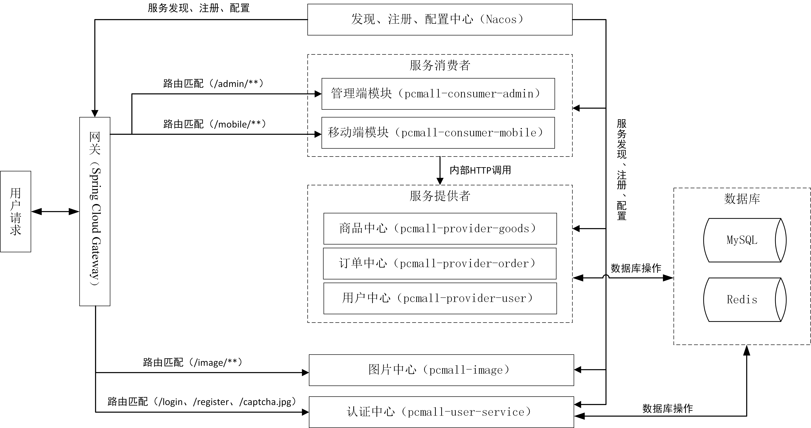
### v2.0：

## 界面效果
### 移动端
<table>
    <tr>
        <td>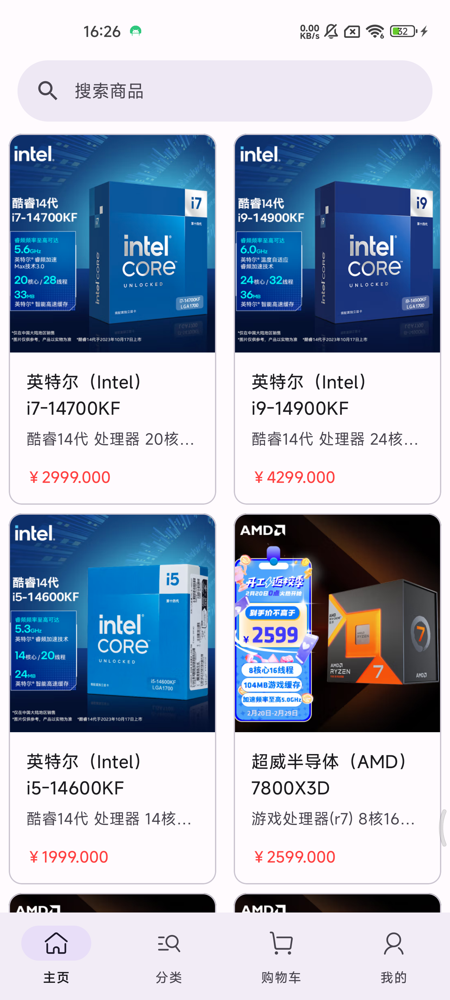</td>
        <td>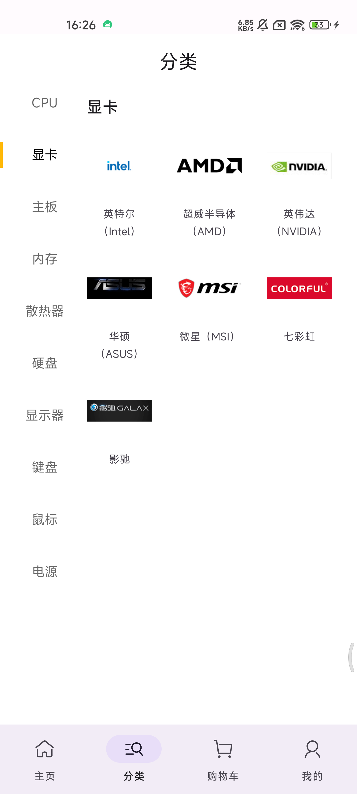</td>
        <td>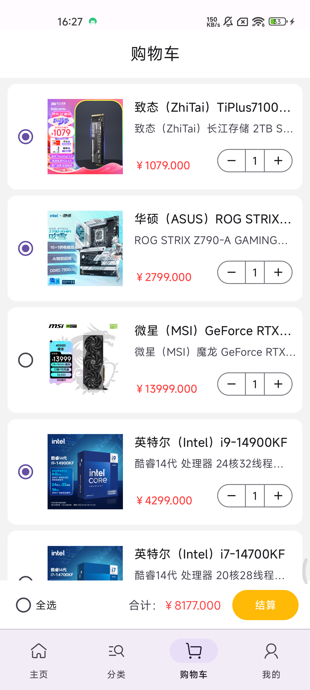</td>
        <td>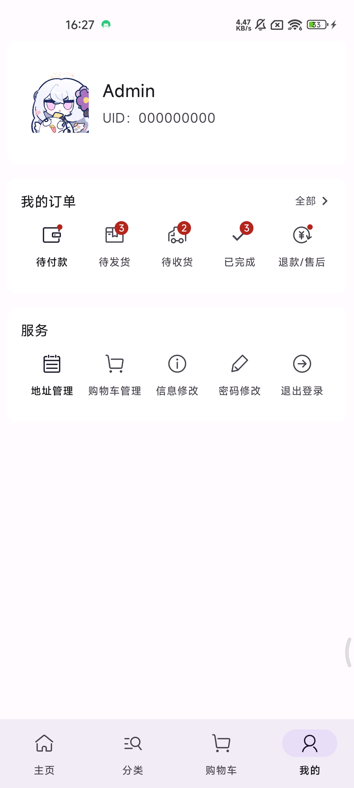</td>
    </tr>
    <tr>
        <td>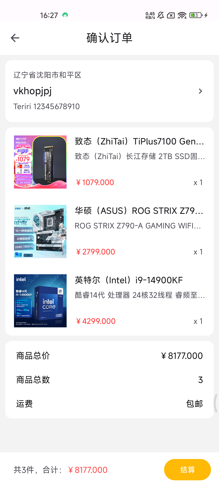</td>
        <td>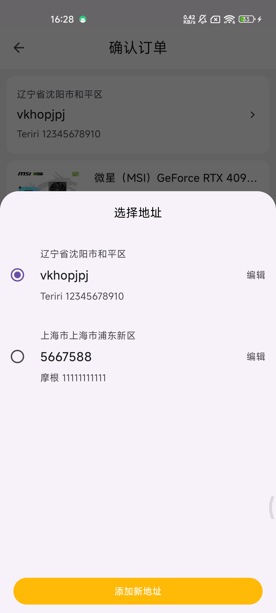</td>
        <td>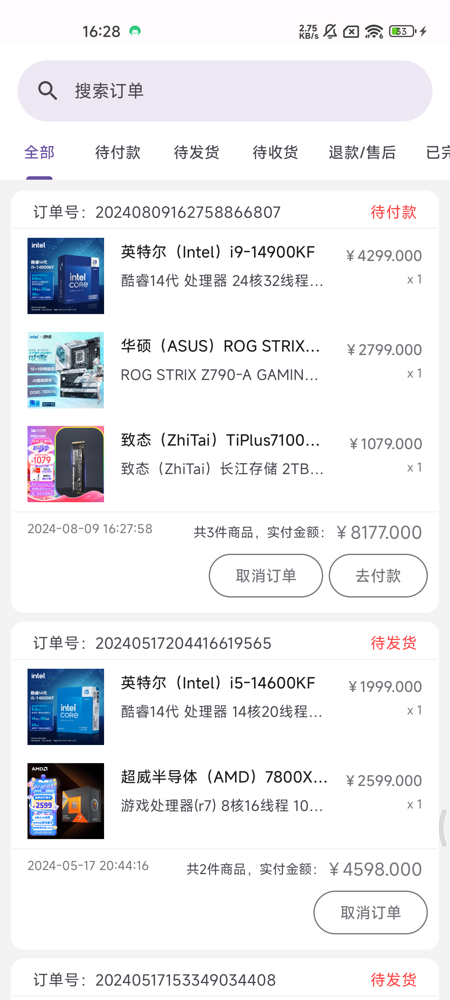</td>
        <td>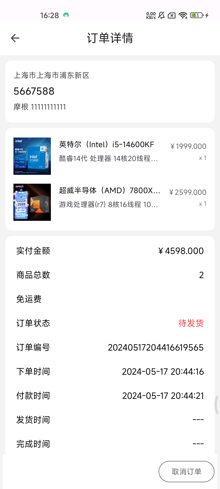</td>
    </tr>
    <tr>
        <td>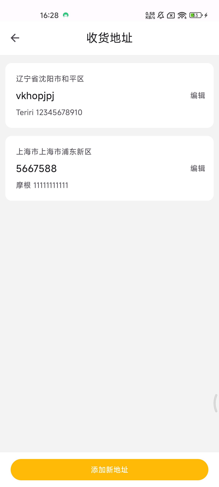</td>
        <td>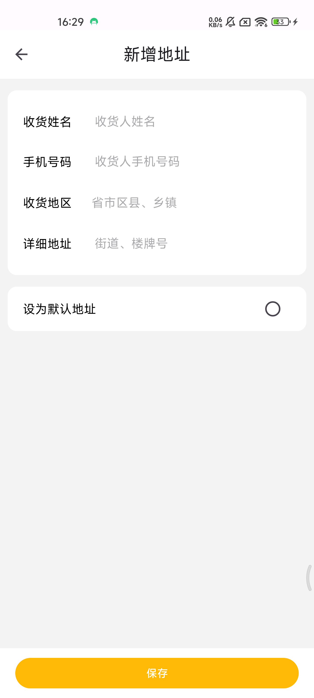</td>
        <td>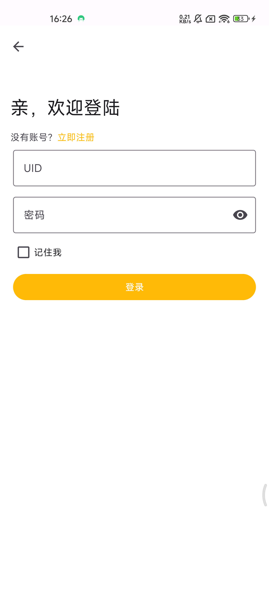</td>
        <td>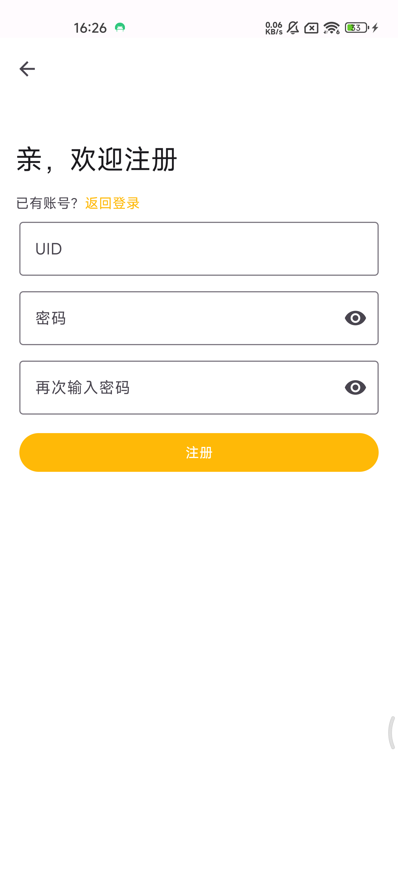</td>
    </tr>
    <tr>
        <td>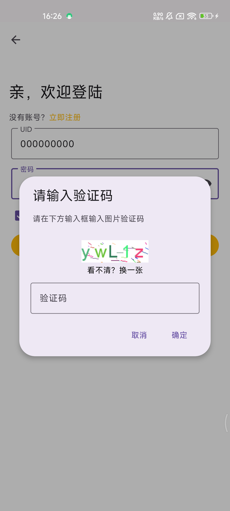</td>
    </tr>
</table>

### 管理端

## 项目结构
### v1.0：
~~~
PCMall
├── pcmall-common         // 通用模块
├── pcmall-gateway        // 网关模块 [10000]
├── pcmall-user-service   // 认证中心 [10001]
├── pcmall-image          // 图片中心 [10002]
├── pcmall-consumer       // 服务消费者模块
│      └── pcmall-consumer-admin                 // 管理端模块 [12000]
│      └── pcmall-consumer-mobile                // 移动端模块 [12001]
├── pcmall-provider       // 服务提供者模块
│      └── pcmall-provider-goods                 // 商品中心 [11000]
│      └── pcmall-provider-payment               // 订单中心 [11001]
│      └── pcmall-provider-user                  // 用户中心 [11002]
├──pom.xml                // 公共依赖
~~~

### v2.0：
~~~
PCMall
├── pcmall-common         // 通用模块
├── pcmall-gateway        // 网关模块 [10000]
├── pcmall-user-service   // 认证中心 [10001]
├── pcmall-image          // 图片中心 [10002]
├── pcmall-consumer       // 服务消费者模块
│      └── pcmall-consumer-admin                 // 管理端模块 [12000]
│      └── pcmall-consumer-mobile                // 移动端模块 [12001]
├── pcmall-provider       // 服务提供者模块
│      └── pcmall-provider-address               // 地址模块 [11000]
│      └── pcmall-provider-brand                 // 商品品牌模块 [11001]
│      └── pcmall-provider-cart                  // 购物车模块 [11002]
│      └── pcmall-provider-category              // 商品分类模块 [11003]
│      └── pcmall-provider-goods                 // 商品模块 [11004]
│      └── pcmall-provider-order                 // 订单模块 [11005]
│      └── pcmall-provider-storage               // 商品存储模块 [11006]
│      └── pcmall-provider-user                  // 用户模块 [11007]
├──pom.xml                // 公共依赖
~~~

## 核心代码
### 1. Spring Cloud GateWay配置